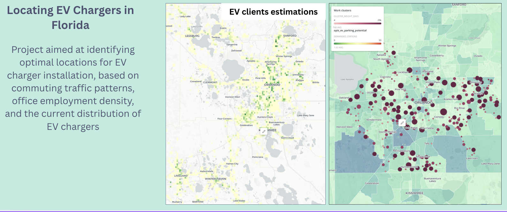
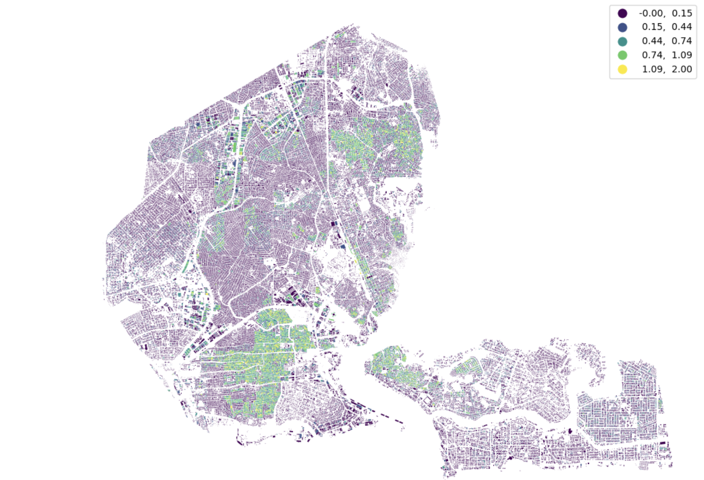
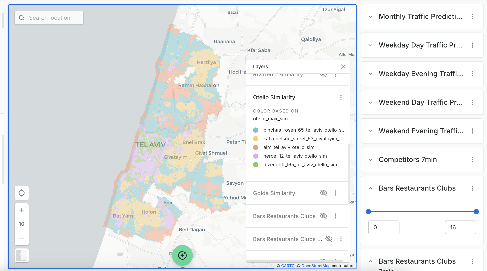

[← Back to Home](index.md)

# 📂 Case Studies Examples

## 🛒 Darkstores Location Strategy (Yango Deli/ Yandex Lavka)
**Role:** GeoData Scientist | **Location:** Global (Israel, Russia, UK, SA)
 

### The Challenge I: Develop Chain expantion strategy  
The company needed to optimize its existing delivery network and plan expansion into new markets. The goal was to balance **fast delivery times** (customer satisfaction) with **operational costs** (minimizing the number of darkstores).

**The Methodology (Pipeline)**  
I built an end-to-end simulation engine to solve this:

```text
[Raw Demand Data] ──> [Spatial Clustering] ──> [Network Optimization] ──> [Final Site Coordinates and Service area]
(Socio-demographics)      (DBSCAN)              (Linear Programming)           (Strategic Locations)
```

### The Challenge II: Site Selection in  (Israel & Russia) based on historic data
The company wanted to expand into new cities but didn't know where exactly to open new warhouses to maximise potential demand.

**The Methodology (Pipeline)**
I developed a predictive framework to forecast demand in new territories:

```text
[Multi-Source Data]  ──>  [Feature Engineering] ──>  [ML Prediction Model] ──> [Strategic Output]
(Census, Buildings, Orders) (200m Grid Aggregation) (Forecast 6-mo Volume) (Demand Heatmap)
```


---

## ⛽ Global Retail Site Selection (Locatium)
**Industry:** Retail & Energy
**Location:** UAE, USA, Global

**The Challenge**   
Global clients needed to select the most profitable locations for new gas stations, retail and restaurants chains across vast regions in the UAE and USA. 

**The Methodology (Pipeline)**   
I designed a multi-stage spatial modeling framework:

```text
[Spatial Data Ingestion] ──> [Traffic Simulation] ──> [Predictive Modeling] ──> [Site Scoring Map]
(POIs, Demographics, Streets) (Gravity Models & OD Matrix) (Service Penetration)   (Optimal Locations)
```

**Examples of results**



---

## ⛽ FTTH potential at building level (Locatium)
**Industry:** Telecom
**Location:** Nigeria, Brasil, Indonesia

**The Challenge**   
Major telecom operators needed to prioritize Fiber-to-the-Home (FTTH) rollouts in dense cities like Lagos, Jakarta, and São Paulo. **The main problem** was identifying profitable neighborhoods to target first, as these regions lacked high-resolution socio-economic data.

**The Methodology (Pipeline)**   
I developed a proxy-based economic modeling engine:

```text
[Satellite & Geometry] ──> [Morphometric Analysis] ──> [Spatial Clustering] ──> [Revenue Modeling]
(NDVI, Building Shapes)    (Density, Greenery)          (K-Means Context)       (Predicted ARPU)
```
**Examples of results**


---

### 🍦 Data-Driven Site Selection (Rivareno Gelato)
**Role:** Spatial Analyst | **Location:** Tel Aviv (2025)
 

**The Challenge**   
A premium Gelato brand needed to open a new branch without cannibalizing their existing store. They required a location with high evening foot traffic and specific demographic alignment.

**The Methodology (Pipeline)**   
I utilized spatial embeddings and interaction modeling to score locations:

```text
[Competitor Analysis] ──> [Traffic Simulation] ──> [Site Scoring] ──> [Interactive Dashboard]
(Embeddings & Similarity) (Gravity Model @ 100m)   (Catchment & KPIs)   (Decision Support)
```
**Examples of results**



---


## 🛠️ Technical Stack

### **languages & Core Libraries**


### **Spatial Analytics & Visualization**


* **Libraries:** `PySAL`, `Folium`, `Shapely`, `Rasterio`, `GeoPandas`

### **Machine Learning & Cloud**


* **Models:** XGBoost, Random Forest, DBSCAN, LogisticRegression, Kmeans
* **Tools:** Python, Docker, Git, BigQuery, PostGIS

---

[← Back to Home](index.md)
